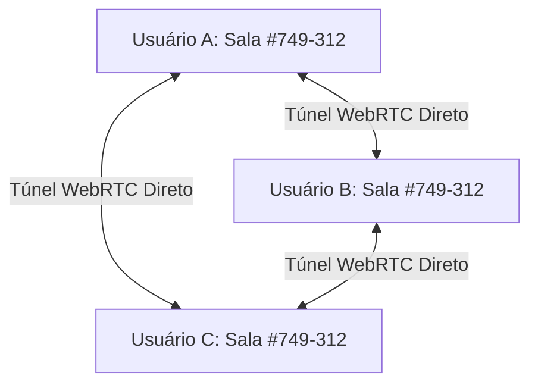

# 👻 GhostDrop P2P (v2.0) — Transferência e Chat Multi-Peer Sem Rastros

[](https://ghostdropp2p.netlify.app/)
[](LICENSE)
[](https://webrtc.org/)
[]()

**GhostDrop P2P** é uma plataforma descentralizada de **transferência de arquivos e chat em grupo**, ultra-rápida, privada e segura. Ela opera de forma **Ponto-a-Ponto (P2P em malha WebRTC Mesh)** sem intermediários — os dados nunca passam nem são armazenados em servidores.

Disponível tanto na **Web (acesso instantâneo sem instalação)** quanto como **executável autônomo para Windows (`.exe`)**.

🔗 **Acesse online:** [https://ghostdropp2p.netlify.app/](https://ghostdropp2p.netlify.app/)

---

## 🌟 Principais Recursos

### 👥 1. Suporte a Múltiplos Participantes (Multi-Peer WebRTC Mesh)
- Conecte **várias pessoas na mesma sala** simultaneamente através de um único código de 6 dígitos.
- Topologia em **malha completa descentralizada (Full Mesh)**: cada dispositivo conecta-se diretamente a todos os outros participantes via canais WebRTC independentes.
- Notificações automáticas de entrada e saída de membros na sala.

### 🏷️ 2. Sistema de Apelidos Personalizados (Nicknames)
- Escolha e edite seu **apelido (nickname)** a qualquer momento diretamente na interface.
- Identificação visual imediata de quem enviou cada mensagem e arquivo com avatares e paletas de cores dinâmicas.
- Indicador de digitação em tempo real: saiba quem está digitando no grupo.

### 📁 3. Transferência Bidirecional de Arquivos Sem Limites
- Envie arquivos de **qualquer formato e tamanho** diretamente da sua placa de rede para os outros dispositivos.
- Arraste e solte múltiplos arquivos simultaneamente.
- Controle de fluxo com **backpressure** para máxima velocidade e estabilidade.
- Validação automática de integridade bit-a-bit com **Hash SHA-256** em cada transferência.

### 💬 4. Chat em Grupo Criptografado (E2EE)
- Troque mensagens instantâneas com todos os membros da sala.
- Mensagens mantidas estritamente na memória volátil (RAM) da sessão — **nada é salvo em disco ou banco de dados**.

### 🔒 5. Zero Rastros (Stealth & Privacidade Extrema)
- **Sinalização Efêmera**: Sinalização de pareamento via brokers MQTT em memória RAM, com retenção desativada (`retain: false`).
- **Criptografia Dupla**:
  - **Sinalização:** Criptografada de ponta a ponta com **AES-256-GCM** e chave derivada por **PBKDF2** a partir do código da sala.
  - **Dados & Chat:** Túnel seguro **DTLS 1.3 / SCTP** com autenticação criptográfica nativa do WebRTC.
- **Botão de Pânico**: Finaliza a sessão instantaneamente e limpa todos os buffers da memória.

### 🌐 6. Travessia de NAT (Cross-Network / Internet)
- Servidores STUN públicos (Google e Cloudflare) integrados.
- Funciona entre redes diferentes (Wi-Fi de casa, 4G/5G, escritórios, etc.) sem necessidade de abrir portas no roteador.

---

## 🚀 Como Usar

### Opção 1: Diretamente no Navegador (Recomendado)
Acesse a versão web hospedada:
👉 **[https://ghostdropp2p.netlify.app/](https://ghostdropp2p.netlify.app/)**

Compatível com todos os navegadores modernos (Chrome, Firefox, Edge, Safari, Brave, Opera) em computadores, notebooks, tablets e smartphones (Android / iOS).

---

### Opção 2: Executável Autônomo Windows (`GhostDrop-P2P.exe`)
Ideal para uso offline ou em ambientes restritos, sem necessidade de instalar Python nem dependências:

1. Acesse a pasta `dist/`.
2. Dê dois cliques no arquivo:
   ```powershell
   dist\GhostDrop-P2P.exe
   ```
3. A interface abrirá automaticamente no seu navegador padrão.

#### Opções de Linha de Comando (Avançado)
```powershell
# Executar em uma porta personalizada
.\dist\GhostDrop-P2P.exe --port 9000

# Executar em segundo plano sem abrir o navegador
.\dist\GhostDrop-P2P.exe --no-browser
```

---

### Opção 3: Executar a partir do Código Fonte (Python)
```powershell
# Clone o repositório
git clone https://github.com/PLSchultz/GhostDrop-P2P.git
cd GhostDrop-P2P

# Inicie o servidor local
python main.py
```

---

## 📖 Passo a Passo: Como Conectar em Grupo



1. **Defina seu Apelido**: Digite seu nome ou apelido no campo de perfil no topo da página.
2. **Escolha ou Gere um Código**:
   - O **Usuário A** pode clicar em **"🎲 Gerar Código Aleatório"** (ou digitar qualquer código de 6 dígitos) e clicar em **"Entrar na Sala"**.
   - O **Usuário B** digita o **mesmo código** (ou acessa o link direto gerado) e clica em **"Entrar na Sala"**.
3. **Sincronização Instantânea**:
   - Assim que ambos entram com o mesmo código, a malha P2P é estabelecida automaticamente.
   - Qualquer número adicional de participantes pode se juntar digitando o mesmo código.


---

## 🔨 Como Compilar Novamente (`build.bat`)

Para gerar um novo executável compilado com PyInstaller no Windows:

```powershell
.\build.bat
```

O script criará o executável otimizado em `dist/GhostDrop-P2P.exe`.

---

## 🛡️ Arquitetura de Segurança & Tecnologias

| Camada | Tecnologia | Finalidade |
| :--- | :--- | :--- |
| **Topologia** | WebRTC DataChannels Full Mesh | Conexão ponto a ponto direta entre todos os nós |
| **Criptografia de Dados** | DTLS 1.3 / SCTP | Túnel criptográfico autenticado para chat e arquivos |
| **Travessia de NAT** | STUN (Google & Cloudflare) | Descoberta de candidatos ICE e conexão cross-network |
| **Sinalização** | Ephemeral WSS MQTT (RAM-only) | Negociação de ofertas SDP e ICE sem logs ou persistência |
| **Criptografia de Sinal** | AES-256-GCM + PBKDF2 (50.000 iterações) | Proteção do payload de sinalização a partir do código da sala |
| **Integridade** | SHA-256 Digest | Verificação matemática bit a bit após a recepção do arquivo |

---

## 📄 Licença

Distribuído sob a licença **MIT**. Veja o arquivo `LICENSE` para mais detalhes.
